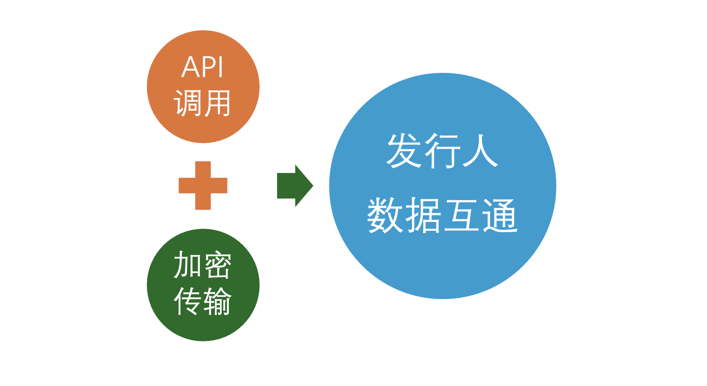

# 2025-Stablecoin-AML-Compliance-Tech-Report

版本：v1.0 
日期：2025 年 8 月 
作者：慢雾安全团队

**目录**

- [摘要](#摘要)
- [一、背景与概述](#一、背景与概述)
  - [1\. 稳定币概述](#1.稳定币概述)
  - [2\. 分类与技术实现](#2.分类与技术实现)
  - [3\. 全球 AML 监管](#3.全球AML监管)
- [二、风险态势分析](#二、风险态势分析)
  - [1\. 稳定币风险特性](#1.稳定币风险特性)
  - [2\. 典型洗钱手法](#2.典型洗钱手法)
  - [3\. 跨境与司法挑战](#3.跨境与司法挑战)
- [三、技术合规实现路径](#三、技术合规实现路径)
  - [1\. 智能合约层合规机制](#1.智能合约层合规机制)
  - [2\. 链上交易模式识别](#2.链上交易模式识别)
  - [3\. 地址风险管理与黑名单系统](#3.地址风险管理与黑名单系统)
  - [4\. 流动性池与跨链监控](#4.流动性池与跨链监控)
  - [5\. AI/ML 的 AML 模型](#5.AI/ML的AML模型)
- [四、全流程防控与治理框架](#四、全流程防控与治理框架)
  - [1\. AML 生命周期防控闭环](#1.AML生命周期防控闭环)
  - [2\. 交易前与交易后监测](#2.交易前与交易后监测)
  - [3\. 应急与处置机制](#3.应急与处置机制)
  - [4\. 链上与链下数据融合](#4.链上与链下数据融合)
  - [5\. API 接口与加密传输](#5.API接口与加密传输)
- [五、建议与趋势](#五、建议与趋势)
- [六、总结](#六、总结)
- [参考文献](#参考文献)

# 摘要

随着稳定币在跨境支付、去中心化金融（DeFi）和数字资产市场中的迅速扩张，反洗钱（AML）与反恐怖融资（CFT）合规逐渐成为监管机构和行业参与者的关注重点。传统 AML 框架在链上环境中面临诸多挑战：链上交易虽透明但具有匿名性，链下身份信息虽完整却存在分散性，这种割裂为风险监测与合规执行带来了明显障碍。在此背景下，香港虚拟资产行业协会（HKVAIA）支持成立了数字资产反洗钱专业委员会（DAAMC），汇聚包括慢雾（SlowMist）、圆币创新科技有限公司、HashKey Group 与 Beosin 在内的多元化创始成员，致力于推动稳定币的合规发行与行业标准建设。

本报告作为 DAAMC 推动行业研究与知识共享的重要成果之一，由慢雾（SlowMist）主导撰写，结合团队在链上追踪、威胁情报与合规实践中的长期经验，对稳定币 AML 的技术路径进行了系统梳理，涵盖监管背景、智能合约层合规、地址风险管理、链上链下数据融合，AI/ML 模型应用及合规落地等方面，并提出了未来趋势与行业建议，期望为监管机构、稳定币发行人及虚拟资产服务商（VASP）提供参考，推动稳定币生态在合规与创新中的持续和健康发展。

# 一、背景与概述

## 1\. 稳定币概述

**（1）定义**

稳定币（Stablecoin）是一类通过与法定货币、商品或其他金融资产挂钩来维持价值相对稳定的加密资产，其核心目标是缓解传统加密货币价格剧烈波动所带来的交易和支付不便。在区块链体系中，稳定币不仅被广泛用于支付与清算，还逐渐成为跨境流动性管理和数字金融创新的关键基础设施。随着应用范围的扩展，它们正处于全球监管和技术治理的共同关注之中。

**（2）功能**

从功能层面来看，稳定币通常发挥三方面作用。第一是价值锚定，凭借相对稳定的价格表现，在加密经济中可以作为记账单位与计价工具，帮助用户和机构在波动性较大的市场环境中缓释风险。第二是跨境支付与结算，凭借点对点性质与全球可达性，稳定币在效率和成本上显示出潜在优势，因此在跨境贸易、汇款以及机构间资金划拨等场景中受到关注。第三是合规衔接，随着部分司法管辖区逐步建立专门框架，稳定币开始被纳入许可管理和披露体系，逐渐被视作支付与清算体系的组成部分，为未来链上金融基础设施的演进提供了实验场。

**（3）市值与主流稳定币**

在理解了稳定币的基本形态与功能后，结合当前市场格局能够更直观地认识其发展动态。根据 DeFiLlama（<https://defillama.com/stablecoins>）的最新数据显示，截至 8 月 19 日，整体稳定币市场的总市值约为 2,768.09 亿美元。从市占率和市值分布来看，USDT 依旧保持领先地位，市值超过 1,663 亿美元，并在过去阶段呈现出相对稳定的增长趋势；USDC 以 679.18 亿美元位居第二，市值走势相对平稳，但与 USDT 仍存在较大差距；其他稳定币则整体规模有限，市值波动相对温和。

（稳定币总市值，来源：DeFiLlama）

从市场占比来看，USDT 占据约 60.14% 的份额，USDC 为 24.56%，USDe 则以 4.13% 位居第三。

（各稳定币占比，来源：DeFiLlama）

观察市值前十的稳定币结构，可以发现：法币抵押型稳定币仍然占据主导地位，其中包括 USDT、USDC、BUIDL、USD1、USDf、PYUSD 等，这类稳定币依靠法币或国债等传统金融资产作为储备，合规性和市场接受度较高。去中心化的加密资产抵押稳定币中，仅有 DAI 挤入前十。与此同时，部分算法型或混合型稳定币也开始崭露头角，例如采用合成美元 + 套保模型的 USDe ，结合算法与部分抵押机制的 USDS，延续合成美元 + 对冲模式的 USDTB。稳定币市场在法币抵押模式占优的同时，也在不断探索新的技术路径与实验性机制。

（稳定币 Top10，来源：DeFiLlama）

**（4）稳定币带来的合规与监管挑战**

随着市场规模的扩大，稳定币相关的 AML 合规风险和监管要求也逐步受到重视，不同司法辖区对稳定币的监管态度和路径存在差异，这些差异意味着稳定币在全球范围内既是金融创新的推动力，也是跨境监管协调的重点对象。需要注意的是，稳定币的“稳定性”并不意味着反洗钱风险自然降低，相反，在某些情境下，其若干特征可能增加高风险主体的利用空间。例如，其高流动性使得像 USDT、USDC 这样的稳定币能够在短时间内跨境转移巨额资金；其可组合性借助交易所、跨链桥和聚合器，使资金能够快速拆分和迁移，增加链上追踪的复杂度；同时，链上与链下的兑换环节可能成为监测难点，例如在场外交易（OTC）场景中，稳定币与现金或银行账户直接对接，形成链上数据难以覆盖的“断点”。因此，仅依赖链上数据通常不足以完成 AML 风控，还需要结合链下金融体系的数据与身份要素，才能实现端到端的追踪与监测。

总体而言，稳定币已在全球金融生态中扮演重要角色，兼具推动支付效率与金融创新的潜力，同时也引入跨境 AML 风险与技术挑战。为了更好理解其合规难点，本报告先梳理稳定币的不同分类与技术实现路径。

## 2\. 分类与技术实现

稳定币的分类与实现方式直接决定了其在支付、结算及合规监测中的表现特征，也影响其在反洗钱技术中的可追踪性与风险水平。业界通常将稳定币分为主要以下三类：

| 稳定币类型 | 代表币种 | 链上透明度 | 典型风险 |
| --- | --- | --- | --- |
| 法币抵押型 | USDT、USDC、FDUSD | 低（链下依赖审计报告） | 链下进出金形成洗钱断点，需强 KYC 和实时对账；链下账户不透明导致储备风险 |
| 加密资产抵押型 | DAI、USDe | 高（全链上可追踪） | 抵押物可能来自高风险来源（混币、跨链桥）；预言机操纵与清算机制风险 |
| 算法型 | UST | 中（合约规则透明但系统性风险较高） | 易脱锚或陷入死亡螺旋；缺乏链下资产支持，冻结和追踪难度大；常被用于匿名套利交易 |
| 混合型 | FRAX、PAXG | 链上 + 链下混合 | 商品抵押型实物托管造假；跨司法辖区合规冲突 |

**（1）法币抵押型**

- 代表：USDT、USDC、FDUSD
- 简介：该类型稳定币由发行方在银行或信托机构存放等值的法币作为储备，并通过智能合约在链上实现发行与赎回，维持 1:1 的映射关系。其优势在于价值锚定清晰、用户信任度较高，同时具备较强的合规配合能力，因此成为当前监管框架下最主流的形态。

（Tether 生命周期图示，来源：Tether 官网）

以 USDT（Tether 发行）和 USDC（Circle 发行）为例，这类稳定币依赖中心化发行方管理，并在智能合约中内置多项合规控制功能，如：

- 冻结（Freeze/Blacklist）：发行方可冻结特定地址的代币，阻止其链上转账，用于应对制裁或洗钱风险；
- 销毁（Burn）：冻结后可销毁代币，通常为了与法币储备同步或处置异常资金，维护储备链的一致性；
- 重铸（Mint）：发行新代币以配套法币赎回，需伴随审计与储备验证，维护系统透明性；
- 解冻（Unfreeze）：在合规审查结束后，可恢复地址转账能力，此类操作较少且通常会谨慎处理。

这些机制为法币抵押型稳定币提供了可操作的链上合规手段，也使其在监管合作中展现出一定灵活性。但与此同时，这种高度中心化的控制模式，也引发了“合规性与去中心化之间的张力”，成为行业讨论的核心议题之一。

**（2）加密资产抵押型**

- 代表：DAI、USDe
- 简介：通过在链上抵押 ETH、BTC 等加密资产并设定超额抵押比例来发行，避免了对中心化法币托管的依赖。这种模式增强了去中心化程度，但也引入了抵押资产价格波动与清算机制复杂性的风险。其实现依赖预言机提供的价格数据以及自动化清算逻辑，一旦抵押率不足，智能合约将强制清算抵押物以维持锚定。从 AML 技术角度看，该模式的优势在于资金流完全链上透明，但劣势在于资金来源合法性难以区分，尤其是在抵押物可能来自混币服务、跨链桥或其他高风险渠道的情况下。技术应对措施包括链上地址聚类、行为模式识别以及高风险流入来源的标注过滤，同时需要结合预言机安全和合约审计，防范因漏洞或价格操纵导致的异常资金流动。

（Maker 协议参与者图示，来源：Maker 官网）

**（3）算法型**

- 代表：UST
- 简介：通过代币供需调节维持价格稳定，不依赖真实资产抵押，通常采用双代币模型，由一类代币吸收价格波动，另一类作为稳定币保持锚定。其技术核心在于通过合约编码的货币规则调节铸造与销毁，并借助市场套利力量维持稳定。然而，在极端市场条件下，该模式易发生脱锚甚至“死亡螺旋”，2022 年 TerraUSD 的崩溃即为典型案例。在 AML 角度，这类稳定币常因缺乏实物支持、冻结和追踪难度较大而被用于高风险套利和匿名交易。对其资金流的监测需要更多依赖交易模式分析和机器学习模型，以识别异常行为和潜在洗钱路径。

除了三大主流模型，近年来出现了其他类型的稳定币。例如，部分抵押型：如 FRAX（部分法币储备 + 部分算法调控）；商品抵押型：如 PAXG（锚定黄金），需监控实物资产链下托管。

这些分类差异不仅影响稳定币的技术实现，还决定了不同类型的稳定币在 AML 风险画像上的差异：法币抵押型的重点在于链下账户与铸销环节的 KYC 与审计，加密抵押型则依赖链上可追踪性与复杂的抵押机制，而算法型则对异常交易模式与系统性风险监测提出更高要求。随着稳定币模式不断演化，如何在不同技术路径下构建灵活而统一的 AML 监测框架，已成为全球监管机构与行业合规团队的共同课题。

## 3\. 全球 AML 监管

不同类型稳定币模式不断演化的同时，如何通过监管框架加以约束与引导也成为关键议题。以下是国际层面及主要司法辖区关于稳定币监管方面的内容：

**（1）FATF 旅行规则**

在国际层面，金融行动特别工作组（FATF）作为全球反洗钱（AML）标准的制定者，已将稳定币纳入其虚拟资产监管框架中。FATF 的《旅行规则》（Travel Rule）要求虚拟资产服务提供商（VASP）在交易中收集并共享发送方和接收方信息，以防范洗钱和恐怖融资风险。该规则适用于稳定币等虚拟资产转移，并强调实时信息交换以提升透明度。截至 2025 年 6 月，FATF 的针对性更新报告显示，99 个司法管辖区已经通过或正在通过实施《旅行规则》的立法，旨在确保跨境支付信息的透明度；自 2024 年定向更新以来，包括朝鲜民主主义人民共和国（DPRK）行为者、恐怖主义融资者和贩毒分子在内的各类非法行为者对稳定币的使用持续增加，目前大多数链上非法活动都涉及稳定币。稳定币或虚拟资产（VA）的大规模采用可能会加剧非法融资风险，尤其是在 FATF 针对 VA/VASP 的标准实施不均衡的情况下；FATF 计划在 2025 年 10 月至 2026 年 6 月期间发布关于稳定币、离岸 VASP 和 DeFi 的简短报告，以进一步支持辖区实施，包括加强监督和风险管理。

**（2）中国香港**

2025 年 8 月 1 日，《稳定币条例》正式实施，引入稳定币发行者的许可制度。条例聚焦于法币挂钩稳定币（FRS），要求发行者需获得香港金融管理局（HKMA）许可，并遵守严格的 AML/CFT 指南，包括客户尽职调查（CDD）和可疑交易报告，发行者必须识别每位稳定币持有者的身份，以防止洗钱风险，此外还需维护储备资产的隔离和定期审计。条例禁止未经许可的稳定币发行。

**（3）美国**

2025 年 7 月 17 日，美国国会通过《GENIUS 法案》，标志着美国首个联邦层面的稳定币监管框架正式落地。该法案将稳定币发行限于“许可稳定币发行者”，要求其遵守《银行保密法》（BSA）和 FinCEN 的 AML 规则，包括旅行规则的适用。发行者需实施客户识别程序（KYC）、监控交易并报告可疑活动，同时禁止向稳定币持有者支付利息。FinCEN 负责制定针对稳定币的特定 AML 规则，以促进创新方法如链上验证，同时确保储备资产的安全隔离。该框架旨在统一州级和联邦监管，强化对洗钱风险的防范。

**（4）欧盟**

《加密资产市场法规》（MiCA）中的稳定币相关规定自 2024 年 6 月 30 日起全面适用。该法规将稳定币分类为资产挂钩代币（ART）和电子货币代币（EMT），要求发行者获得欧盟成员国监管机构的授权，并遵守欧盟 AML 法规，包括旅行规则的实施。加密资产服务提供商（CASP）必须进行客户尽职调查、监控交易并报告可疑行为，同时确保储备资产的隔离和流动性。MiCA 与《反洗钱法规》（AMLR）和转移资金法规（TFR）整合，强调跨成员国一致性，并为 CASP 设置 2025 年 1 月起的许可申请期，以防范稳定币相关的洗钱风险。

**（5）新加坡**

新加坡金融管理局（MAS）于 2023 年 8 月发布稳定币监管框架，并于 2025 年 7 月更新 AML/CFT 指南。该框架针对单货币挂钩稳定币（SCS），要求发行者持有 MAS 许可证，并遵守《支付服务法》（PSA）下的 AML 要求，包括客户尽职调查、交易监控和旅行规则的适用。稳定币必须由低风险、高流动性储备资产支持，并通过定期审计确保价值稳定。只有符合所有要求的稳定币可标记为“MAS-regulated stablecoins”。MAS 强调对算法挂钩或非储备支持稳定币的严格审查，以降低洗钱风险。

**（6）日本**

日本金融厅（FSA）通过《支付服务法》（PSA）修订案监管稳定币，该修订于 2023 年生效，并在 2025 年进一步更新。稳定币发行限于银行、信托公司和资金转移运营商，要求遵守严格的 AML/KYC 规则，包括客户识别和可疑交易报告。2025 年 8 月，日本正准备推出首个日元挂钩稳定币（JPYC），强调储备资产的国内托管和隔离，以防范洗钱风险。

**（7）韩国**

2024 年，《虚拟资产用户保护法》正式生效，要求虚拟资产服务提供商（VASP）遵守 AML 法规，包括旅行规则和客户尽职调查。金融情报单位（FIU）于 2025 年 8 月开始重组 AML 协议，以加强稳定币监督，并研究全球标准以防范洗钱和恐怖融资风险。金融监督委员会（FSC）计划于 2025 年 10 月向国会提交韩元挂钩稳定币监管法案，该法案将首次建立稳定币的法律框架，焦点包括发行规则、储备管理及内部风险控制。

稳定币的 AML/CFT 监管在国际和主要司法辖区正逐步趋紧，呈现出“国际框架指引 + 本地差异执行”的格局。FATF 虽提供了整体标准，但各地在旅行规则实施、储备管理以及跨境信息共享方面的进度和深度仍存在差异。由此带来的监管碎片化与技术挑战，需要在保障创新与风险防控之间寻找平衡。这些监管要求不仅界定了稳定币的合规边界，也为后续技术路径和实践探索提供了参考方向。

# 二、风险态势分析

## 1\. 稳定币风险特性

稳定币的设计初衷是为支付、清算和跨境资金流动等提供相对稳定的价值载体。然而，从 AML 视角来看，稳定币的“稳定性”并不意味着风险降低，反而由于其高流动性、跨境便捷性、链上透明与匿名并存等特性，带来了新的合规挑战。

在技术与金融属性层面，稳定币存在锚定机制风险与系统性脆弱性。算法型稳定币在极端情况下可能彻底失效，一个具有全球性影响的案例是 TerraUSD（UST）崩盘，其直接风险表现为算法稳定币的死亡螺旋。UST 通过双代币模型（与 LUNA 联动）维持价格稳定，但在市场压力下脱锚，造成投资者的重大损失。此事件凸显了算法稳定币缺乏实物支持、易受市场波动影响的弱点，对稳定币的合规提出了挑战。

其次，稳定币兼具透明与匿名并存的特性。一方面，链上转账可追溯，为 AML 系统提供了可分析的数据基础；另一方面，如果缺乏链下 KYC 数据支撑，极易出现“透明却无法归属”的现象。现实中，稳定币发行方多次冻结与犯罪活动相关的资金。例如，据 Cointelegraph 报道，Tether 在 2023 年 11 月将价值超过 37.4 万美元的被盗资金列入黑名单，而四大稳定币发行商中有三家已将与 Lazarus 相关地址集群中价值 340 万美元的资金列入黑名单。这表明，稳定币的透明性为 AML 监测提供了条件，但若身份信息缺失，依然可能被广泛用于洗钱与恐怖融资。

在非法活动风险方面，稳定币因其便捷和广泛接受度，被频繁用于跨境洗钱与非法汇兑。朝鲜 Lazarus 黑客组织堪称最具代表性的威胁，该组织自 2009 年起活跃，至 2023 年前已窃取超过 30 亿美元的加密资产，资金流转路径显示，稳定币成为其洗钱工具中的关键一环。Lazarus 善于利用 TRON 网络和未受监管的 OTC 渠道实现资金分层和匿名转移，典型事件包括 Bybit 被盗 14.6 亿美元。与此同时，近期曝光的案例揭示了东南亚诈骗团伙如何利用香港 OTC 渠道进行产业化运作。内地大学生受雇充当“跑腿”，在二手平台接单，用他人转账的人民币兑换港币后购买 USDT 并转至指定钱包，事后发现资金来源为电信诈骗赃款，银行卡被警方冻结，因而在不知情的情况下沦为洗钱链条中的“车手”。链上追踪显示，涉案 USDT 最终流入东南亚担保平台（如汇旺担保、新币担保），这些平台长期为博彩和电诈等黑灰产提供服务。其核心模式被称为“卡接回 U”，即通过“卡农”收取赃款，迅速兑换为加密货币并进行分层转移，佣金比例高达 30% 以上。调查显示，该洗钱网络在三个月内清洗资金超过 31 万美元，由东南亚有组织犯罪集团操控，形成高度专业化和分工明确的跨境洗钱产业链。这一案例凸显了香港 OTC 渠道在稳定币 AML 体系中的脆弱性，也表明传统“现金换 U”模式已演变为结合跨境资金流、线上电诈和链上快速转移的混合洗钱路径。

（事件流程图，来源：Bitrace）

类似风险在中国大陆也呈高发趋势：近期多地司法机关披露的案件显示，以泰达币（USDT）为代表的虚拟货币正在沦为跨境“对敲”（非法跨境汇兑）的核心工具。其中，杨某非法换汇案涉案金额高达 65 亿元人民币，犯罪分子利用稳定币及跨境“对敲”方式，将境内外兑换需求资金进行洗钱和转移。在传统“对敲”模式的基础上，虚拟货币的介入进一步增强了非法换汇的隐蔽性，使得这类高额跨境汇兑案件的涉案金额愈发庞大。

稳定币虽然本身是中立的工具，但当其与隐私协议、交易所等基础设施结合时，往往会放大合规风险。例如，2022 年，美国 OFAC 将 Tornado Cash 合约列入制裁名单，制裁声明中提到，Tornado Cash 自 2019 年以来处理了超过 70 亿美元的加密货币交易，尽管 OFAC 的制裁直接针对 Tornado Cash 的智能合约地址，而非稳定币本身，但此举对稳定币生态产生间接影响。例如，制裁后，Circle（USDC 发行方）冻结了与 Tornado Cash 相关地址中的约 75,000 USDC，以遵守 OFAC 的制裁要求。另一个案例是 Garantex 交易所。2025 年，美司法部联合德国、芬兰执法打击加密交易所 Garantex，关闭 Garantex 的在线基础设施，该交易所涉嫌为跨国犯罪组织及恐怖组织洗钱。据了解，Garantex 自成立以来处理了至少 960 亿美元的交易，包括为 Lazarus Group、俄罗斯寡头及多家勒索软件团伙提供服务。在美国执法部门协同 Tether 公司执行链上冻结后，Garantex 服务被强制停止，冻结了大量涉及 USDT 的中转资金。

在合规与司法实践层面，稳定币还面临跨境差异与执法时效问题。不同国家和地区的监管标准不一致，导致同一笔稳定币交易在 A 国可能被视为合规，而在 B 国却触发 AML 风险，这种监管碎片化使得跨境监测和执法协作难以高效开展。加之稳定币转账的即时性，使司法冻结与跨境执法往往“慢半拍”，导致大量可疑资金在措施启动前已完成分拆与转移，追缴难度大幅增加。

历史与近期案例均表明，稳定币的风险特性并非源于单一因素，而是技术、市场与制度多重作用的结果：它们既可能因技术设计缺陷或市场事件引发系统性资金外流，也可能在高风险主体的有意操纵下成为跨境洗钱工具。因此，有效的稳定币 AML 体系需要结合链上透明度与链下合规信息，并建立覆盖全生命周期的动态防控机制。

## 2\. 典型洗钱手法

**（1）OTC 场外换汇绕过 KYC**

OTC 场外换汇是稳定币 AML 风险的重要来源之一。通过未受监管或缺乏严格 KYC 流程的场外交易平台，交易者能够将法币兑换为稳定币，从而在一定程度上绕过监管和审查。此类交易往往伴随大额资金跨境转移，并增加链上追踪难度。黑灰产资金常以现金或非法来源法币进入 OTC 市场，再直接兑换为 USDT/USDC 等稳定币。由于 OTC 商户普遍缺乏完善 KYC/AML 流程，这一环节成为资金上链的隐蔽通道。链上监控中可通过资金流向聚类及高风险 OTC 钱包标签比对，对潜在风险资金进行识别。

**（2）链上拆分与分层**

获得稳定币后，洗钱方通常将大额资金拆分为多笔小额交易，分散至多个新生成地址，以掩盖资金来源和规模。随后，这些资金可能通过不同 DEX 进行二次兑换，或跨链转入其他区块链，再回流至目标账户。技术上，可通过交易网络复杂度、资金流入流出比异常及跳数统计，识别潜在可疑模式。类似路径常出现在黑客攻击或资金窃取事件中，例如黑客盗取的稳定币常在短时间内完成数十次链上拆分，以增加冻结难度和追踪复杂度。

**（3）跨链桥 + 隐私工具**

跨链桥与隐私工具结合使用，是另一类常见洗钱路径。交易者通常先通过跨链桥将稳定币转移到不同区块链，再将 USDT/USDC 兑换为 ETH、BTC 等资产，最终投入混币服务（如 Tornado Cash）以打断资金可追溯性。通过图网络分析和交易行为模式识别，可以锁定潜在可疑资金流。经混币协议和跨链桥多次拆分与合并后，资金最终可能进入中心化交易所，形成复杂资金路径，增加 AML 追踪难度。

**（4）DeFi 套利与短期出金**

DeFi 平台套利及闪电贷操作也是典型的短期资金流洗钱手法。用户利用价格波动或闪电贷在短时间内进行大额稳定币交易，通过跨协议套利获利后出金。这类操作通常涉及多笔交易嵌套在同一区块或多个区块内，短时间内生成大量链上数据，对 AML 监控提出挑战。实践中，执法机构可通过链上分析工具追踪套利资金流向，并结合交易行为异常检测，识别高风险交易并采取冻结措施，实现资金追回。

**（5）嵌套账户操作**

攻击者通过控制多个账户在同一交易所内循环转账，将大额资金拆分为多笔小额交易，形成复杂交易网络，传统 AML 筛查可能难以识别。链上监控技术结合地址风险标签、交易金额分布及对手方行为模式分析，可有效识别此类嵌套交易行为，并提供潜在可疑交易线索。

## 3\. 跨境与司法挑战

稳定币作为跨境支付与清算的“技术底座”，天然突破了传统银行系统的国界限制，这一特性在合规层面既是优势，也是反洗钱的重大挑战。部分国际案件显示，当资金通过稳定币跨境流动时，其速度与匿名性往往超出现有合规体系的反应能力，从而在 AML 监管中制造了“时间差与空间差”的双重难题。

**（1）司法差异与旅行规则落地困境**

虽然 FATF 在 2019 年提出了针对虚拟资产与 VASP 的全球标准，并在之后多次强调稳定币的 AML 风险，但不同地区在本地化落地过程中存在差异，正如“全球 AML 监管”部分所提及的内容，由于这些制度差异，当稳定币资金跨越多个司法辖区时，容易出现监管真空。例如，一笔 USDT 从受监管地区流入合规要求较弱的司法区，相关机构在链下环节很难获得完整身份信息，形成 AML 断点。只有在跨国协作与链上技术并行下，才存在阻断犯罪资金链的可能性。

同时，从技术角度看，旅行规则的实现需要消息传输协议、加密通信与跨平台兼容性。目前行业内虽有 TRISA、IVMS101 等协议尝试，但尚未实现全球范围的互操作性，存在“半兼容、半孤岛”问题，导致跨境资金在不同合规系统之间无法完全匹配。例如，当合规主体与非合作方互动时，旅行规则信息可能无法被有效传输或验证，从而削弱 AML 效果。

**（2）跨链与多链司法断点**

稳定币可以在多条公链间流动，这使得 AML 的复杂度显著提高。部分网络因交易成本低、速度快更容易被资金滥用，而跨链工具进一步增加了隐蔽性。尽管业界已有跨链可视化与监测方法，但这些往往依赖大规模的数据接入与算力支持，对于单一司法辖区的监管机构而言几乎不可能独立完成。因此，跨链 AML 的有效实现依赖国际合作与第三方技术供应商。香港金管局也指出，持牌稳定币发行人需要与具备跨链追踪能力的分析公司合作，以增强其在多链场景下的 AML 技术防护。

**（3）跨境执法协作与时效挑战**

即便链上资金路径可以被追踪，链下执法的时效差异也可能导致 AML 失效。例如，资金在数小时内通过多国平台和 DEX 完成多次转移，执法部门在完成司法协作请求前，资金可能已经进入难以冻结的高风险司法辖区。历史案例表明，即时响应的司法区才有可能冻结部分资金，而响应滞后的司法区则可能完全失去追缴机会。跨境 AML 的核心不仅是合规制度接轨，更是执法执行的实时性与协作能力。

这些挑战的共同特点是传统 AML 框架建立在以国家为边界的金融体系之上，而稳定币的特性跨越了国界和链路，真正难点在于如何构建全球范围的实时监控、跨链追踪和司法互信体系，而不仅仅是满足本地合规要求。

# 三、技术合规实现路径

## 1\. 智能合约层合规机制

本小节探讨稳定币智能合约如何通过扩展现有代币标准，嵌入反洗钱（AML）与反恐怖融资（CFT）合规要求并在可行范围内推动链上自动化合规流程。

**（1）增强型代币标准与协议层支持**

传统的代币标准（如 ERC-20）缺乏原生支持复杂合规需求的功能。若仅依赖链下解决方案，将难以审计和验证每一笔交易的合规性。因此，本报告建议设计一种新型智能合约标准，在 ERC-20 基础上扩展核心模块，包括 Pausable（全局暂停）、Freezable（账户冻结）、Whitelist（白名单限制）、Blacklist（黑名单禁止）和 AccessControl（基于角色的访问控制）。这些模块强调操作安全性、权限可控性和风险可追溯性，推荐采用经过广泛审计的标准库（如 OpenZeppelin）进行功能扩展，以最大限度保障安全性。

**（2）核心角色与基于角色的访问控制**

为降低单点故障和内部滥用风险，可引入基于角色的访问控制（RBAC）。相比单一“管理员”模型，RBAC 能够更好地实现职责分离。可以定义一系列清晰的角色，并将这些角色分配给不同的、由多重签名钱包控制的实体或员工，以最大限度降低单一故障点或合谋操纵的风险。每个角色应限于特定职能，所有操作需多签名授权，并确保无单一员工同时持有多个高风险角色。所有操作应记录日志，并接受定期第三方审计，权限分配可由管理员或董事会监督。

除了 MINTER_ROLE（负责铸币）、BURNER_ROLE（负责销毁）、PAUSER_ROLE（负责全局暂停）、RESUME_ROLE（负责恢复）、FREEZER_ROLE（负责冻结特定账户）、WHITELISTER_ROLE（负责管理白名单）、BLACKLISTER_ROLE（负责管理黑名单）、UPGRADER_ROLE（负责合约升级）等角色外，建议引入一个关键的新角色 ATTESTER_ROLE。此角色被授予持牌 VASP 或其他受信任的合规实体，用于在转账发生时对“转账规则”信息的链下交换进行链上证明。

**（3）白名单机制与客户尽职调查**

白名单模式提供较高水平的 AML/CFT 控制，实现事前预防。它是一种“默认关闭”的闭环模式，任何地址，除非经过发行方明确的尽职调查和批准，并被添加至链上白名单，否则无法持有或接收代币。

链下流程

- 用户首先需要在一家持牌 VASP（例如持牌交易所或稳定币发行人自身）开立账户；
- 该 VASP 根据合规要求，对用户执行全面的 CDD。这包括收集并验证用户的身份证明文件、地址证明以及了解其开户目的和资金来源等信息。

链上执行

- 经合规团队批准后，授权操作员可通过一个持有 WHITELISTER_ROLE 角色的多重签名钱包，调用智能合约的 whitelistAdd(address \_attester, address \_account) 函数；
- 智能合约执行该函数，将 isWhitelisted\[\_account\] 的值设置为 true，并将调用者（即 VASP）的地址记录在 attesterOf\[\_account\] 映射中。这创建了一个重要的归属关系，指明了是哪个 VASP 将该用户引入系统；
- 同时支持 whitelistRemoved(address \_account) 函数，用于将地址从白名单移除。

**（4）转账规则断言机制**

为了符合“转账规则”的要求，即转账双方的信息需被记录和传递，建议引入一个链上断言机制。

链下流程

- 当用户 A（在 VASP-1 开户）希望向用户 B（在 VASP-2 开户）转账时，VASP-1 和 VASP-2 可在链下安全地交换用户 A 和 B 的身份信息（姓名、地址等）；
- 如果 VASP-2 的验证和风险评估通过，它会向 VASP-1 发送一个确认回执。此时，双方就本次“转账规则”所交换的信息内容达成了一致；
- 随后，VASP-1 和 VASP-2 的系统将各自独立地、使用相同的算法对这份已达成共识的信息包（包含双方用户信息等）计算出一个唯一的哈希值。这个哈希值即为 travelRuleHash。由于输入数据和算法完全相同，双方计算出的哈希值也必须完全一致。

链上证明

- 在执行链上转账前，发起方 VASP-1（即用户 A 所在的机构），通过其持有 ATTESTER_ROLE 角色的多重签名钱包，调用智能合约的 submitTravelRule 函数提交包括由链下计算获得的 travelRuleHash。接着，合约会查询 attesterOf\[\_from\] 映射，验证调用者是否就是用户 A 的官方“身份验证者”。验证通过后，合约会在 travelRuleAttestations 映射中创建一个记录；
- 接收方 VASP-2（即用户 B 所在的机构），同样通过其 ATTESTER_ROLE 多签钱包，调用 confirmTravelRule 函数。以确认由发起方 VASP-1 提交的客户转账信息。这将在链上证明两个持牌机构已就一笔特定交易的“转账规则”要求达成一致并共同背书；
- 在双方 VASP 完成链上断言后，系统现在允许执行实际的代币转移。通常由发起方用户 A（或 VASP-1 代表用户 A）调用智能合约的 transfer 或 transferFrom 函数进行转账。

为此，智能合约中可定义以下数据结构和事件：

- 转账状态枚举：enum TravelRuleStatus{None, Submitted, Confirmed, Transferred}；
- Travel Rule 哈希及必要的转账状态信息结构体：struct TravelRuleData，包含 originatorVASP、beneficiaryVASP、travelRuleHash、from、to、amount、expiry、status；
- 映射：isWhitelisted（存储用户的白名单状态）、attesterOf（存储用户由哪个 Attester 验证）、travelRuleAttestations（存储 Travel Rule 哈希及必要的转账状态信息）；
- 事件：WhitelistAdd、WhitelistRemoved、SubmitTravelRule、ConfirmTravelRule、TransferTravelRule。

**（5）核心代币操作的合规扩展**

为了支持合规要求，建议稳定币智能合约在基础的 ERC-20 功能上进行扩展，集成一系列核心管理功能。

铸币机制

- 发行应是“审慎和稳健的”，铸币需“与相关储备资产池的相应增加相匹配”，发行人可在收到资金和有效的发行请求后向其客户发行；
- 智能合约本身无需强制执行“完全储备”要求，但铸币权限是关键的控制点。链上的铸造函数可被设计为只能由一个能够验证链下条件已满足的可信实体（即发行人自己）调用；
- 前置检查：函数在执行铸币前，应检查目标地址 to 是否处于黑名单或被冻结状态；
- 操作流程：客户完成所有必需的链下 KYC 和 CDD 流程；客户将等值法币资金转入发行人指定银行账户；发行人内部系统确认收到资金并更新储备资产记录；运营团队创建并签署多重签名交易，调用智能合约的铸造代币函数，将新铸稳定币发送到客户预先注册并验证的钱包地址。

赎回/销毁机制

- 发行人可在收到有效的赎回请求后，在切实可行的范围内尽快处理。储备资产的提取可与流通中的指定稳定币面值的相应减少相匹配；
- 赎回是一个涉及链上与链下交互的两步过程。为避免法币转账失败的风险，代币的销毁操作应在确认法币结算之后进行；
- 赎回准备：用户首先需要将要赎回的代币转移至发行人控制的指定地址；
- 操作流程：用户通过平台提交链下赎回请求并进行 CDD；发行人系统验证请求有效性并检查链上代币转移情况；发行人将等值法币转账至用户预注册银行账户；在确认法币转账成功后，持有 BURNER_ROLE 的多重签名钱包调用销毁函数。

紧急控制：暂停与冻结

- 合约可支持暂停、恢复、拉黑、移除黑名单、冻结、解除冻结等操作，这些是事件管理框架的关键组成部分；
- 暂停（Pause）：一个全局性的“紧急停止开关”，旨在实现对合约核心功能（转账、铸币、销毁）的即时中止，由持有 PAUSER_ROLE 的多重签名钱包调用。通常在检测到异常事件（如合约被利用、储备资产不匹配）时触发。恢复功能由独立的 RESUME_ROLE 处理；
- 冻结（Freeze）：一种账户级别的限制措施，可阻止某个特定地址发送或接收代币，但不会影响网络中其他地址的正常活动。由持有 FREEZER_ROLE 的多重签名钱包调用，触发条件包括可疑活动（如 AML 警报或法院命令）。

地址筛选与黑名单机制

- 发行人可采取措施，例如“将被识别为受制裁或与非法活动相关的钱包地址列入黑名单”。这可作为一个在链上强制执行的机制，仅链下警告是不够的；
- 函数实现：实现黑名单添加、移除功能的函数，仅由持有 BLACKLISTER_ROLE 的多重签名钱包调用；
- 转账限制：禁止加入黑名单的地址转移/接收代币；
- 操作流程：分析工具发出警报，触发内部合规审查，合规团队审查确认后，由 BLACKLISTER_ROLE 多签钱包发起黑名单添加交易。

智能合约的可升级性

- 稳定币相关的所有智能合约架构可能采用“可升级性”。这允许发行人在不中断现有合约状态的情况下更新逻辑，以应对漏洞修复、功能扩展或监管变更；
- 代理模型：对于 EVM 类型的智能合约来说，可以采用成熟的 ERC-1967 代理模型以实现可升级性；
- 权限控制：升级函数可仅由持有 UPGRADER_ROLE 的多重签名钱包调用；
- 变更管理流程：在提议任何升级之前，需完成一个严格的变更管理流程，其中包括对新的逻辑合约进行全面的、独立的第三方安全审计。

用于分析和报告的链上事件日志

- 发行人可建立稳健的“信息和会计系统”，以“及时、准确地记录所有业务活动，包括链上和链下信息”，并“保留适当的审计追踪”；
- 智能合约可为每一次重要的状态变更发出详细的事件（Events），以便链下系统进行日志记录、监控和生成报告。这些事件在区块链上创建一个不可篡改且永久的日志，是所有链下监控、会计和报告系统的主要数据源；
- 除了 ERC-20 标准的要求的转账（Transfer）、授权（Approval）事件外，合约可为所有管理行为和状态变更定义并发出自定义事件：代币铸造 / 销毁（Minted / Burned）事件、合约暂停 / 恢复（Paused / Resume）事件、黑名单添加 / 移除（BlacklistAdded / BlacklistRemoved）事件、白名单添加 / 移除（WhitelistAdded / WhitelistRemoved）事件、地址冻结 / 解除冻结（AddressFrozen / AddressUnfrozen）事件、特权角色变更（RoleGranted / RoleRevoked）事件、合约升级（Upgraded）事件。

**（6）密钥管理与部署运维安全**

建议将传统金融级别的安全态势应用于加密原生操作。实施这种级别的密钥管理可作为任何发行人的核心运营部分。

- 密钥生成：可通过一个有详细文档记录的“密钥仪式”（key ceremony），在一个物理安全的、与外界网络完全隔离的气隙环境（air-gapped environment）中完成；
- 密钥存储：所有管理角色可由多重签名钱包控制。这些多签钱包的签名者所使用的私钥，可存储在 HSM（硬件安全模块）或其他的安全硬件钱包中。对于最关键的角色，其对应的密钥最好保存在气隙系统中，与任何在线环境物理隔离；
- 密钥使用：可强制执行多重签名策略。对于涉及“重要私钥”的交易签名，可能需要相关人员亲自到场操作；
- 备份与恢复：密钥分片或助记词的备份可存储在安全且地理上分散的多个位置，并采用防篡改的包装。

部署流程和运行时监控可作为技术风险管理框架的延伸，强调从源头防范漏洞并持续监测运营风险。例如，在正式部署之前，可制定并执行一份“部署前检查清单”：全面测试（95% 以上覆盖率）、独立审计（至少一家、最好两家信誉良好的审计公司）、代码冻结（审计后冻结代码直至上线）、回归测试、合规签核、部署演练、授权部署。在完成部署后可采取适当监控措施，以对特权角色的使用情况以及新出现的威胁及时实施缓解措施：链上活动监控（例如使用慢雾安全监控系统 MistEye 添加关键角色活动监测）、威胁情报监测（例如使用慢雾安全监控系统 MistEye 的威胁情报订阅）。

**（7）退出机制**

稳定币的智能合约从设计之初就需要考虑其自身的“退役”过程，它需要具备能够实现有序关停的状态与机制：

- 制定业务退出计划：计划可涵盖可能导致有序终止的各类情形，并包含对这些情形实际发生或潜在发生的监测措施；
- 链上退出流程：可暂停智能合 约以停止所有代币转移行为，以确保最大化储备资产变现收益、最小化对整体市场稳定的影响；依托赎回功能与白名单功能，协助稳定币持有人提交赎回申请。

## 2\. 链上交易模式识别

在稳定币反洗钱技术体系中，链上交易模式识别是基础且核心的能力。稳定币交易本质上是区块链账本状态的可验证更新，这为 AML 技术提供了透明的数据基础，使得资金流特征可以被提取、分析并用于识别潜在的高风险活动。全球范围内的实践表明，通过多维度数据分析，链上模式识别不仅可以发现异常资金流向，还可以为执法部门提供可操作的风险信号，从而在跨链和跨境场景下提升监测效率。

从技术角度看，链上交易模式识别主要依赖以下几个层次：

**（1）地址聚类与行为画像**

攻击者通常不会只使用一个地址，一种常见的方法是行为聚类分析，地址聚类是指将同一个人或实体控制的地址集合进行聚合。比如，一个地址频繁在每天凌晨活跃、使用特定交易平台、几乎只交易某种稳定币、始终通过相同路径跨链资金，这样的规律就形成了一个相对独特的“链上指纹”。多个地址如呈现出相似操作习惯、交互对象与交易节奏，可以辅助建立“链上指纹”和行为主体识别：

- 输入特征：在一笔交易中，如果多个地址联合输入资产（例如 BTC UTXO 模型中多个输入），常被认为这些地址由同一主体控制；
- 行为特征：多个地址在短时间内接收同一来源地址的资金，并在相似时间内做出行为反应（如跨链、DEX 交易），可能是同一操作者控制；
- 服务特征：如多个地址均调用了某个特定合约（如资金盘平台、黑灰产代币合约），且行为路径高度相似，可以视为行为簇；
- 交易参数特征：某些攻击者地址在转账时设定的 Gas 限额、交易滑点、手续费偏好具有重复性，可以作为聚类补充特征；
- 地址结构特征：有些团伙创建地址存在命名规律，例如宣称对 Nobitex 攻击事件负责的黑客组织 Gonjeshke Darande 在该事件中使用多个带有情绪性、挑衅性词汇的地址，如 TKFuckiRGCTerroristsNoBiTEXy2r7mNX、0xffFFfFFffFFffFfFffFFfFfFfFFFFfFfFFFFDead、1FuckiRGCTerroristsNoBiTEXXXaAovLX。

**（2）交易模式特征提取**

洗钱资金在链上往往呈现特定“行为指纹”，如高频小额分拆、多跳转移到新生成地址、集中流入匿名化服务、或在去中心化交易所进行频繁兑换。通过结合交易图结构与时间序列，可以识别资金集散枢纽和异常转账行为。例如，图算法可用于发现资金集散节点，而基于时间窗口的频率异常分析可以识别拆分交易模式。若系统具备链上模式识别能力，可以及时触发标记或干预措施。

**（3）可疑模式与执法协作**

链上交易模式识别的目标是与将透明账本转化为可解释的风险信号，并支持全球范围的合规申报与执法协作。例如，当系统检测到某一批稳定币地址呈现典型的“分拆 + 混币 + 跨链”组合模式时，可以自动生成可疑交易报告（STR），并提交给相关金融情报组。在慢雾的实践经验中，模式识别与执法协作往往需要“信号优先”机制，即在不完全确认资金归属的情况下，尽快通过模式特征锁定可疑地址群体，实现链上标记并在有冻结能力的环节进行阻断，为后续调查争取时间。

## 3\. 地址风险管理与黑名单系统

在稳定币的反洗钱技术架构中，地址风险管理与黑名单系统往往承担着“防火墙层”的角色。它既用于阻断已知高风险主体链上活动的重要手段，也为实时监控、自动化预警和执法响应提供了操作基础。但在现实应用中，其效果常常依赖于数据质量、更新速度以及跨机构协作程度，难以单独构成完整防护。

**（1）地址风险管理的核心逻辑**

地址风险管理的关键在于对链上地址进行分级与动态画像，以便针对不同风险水平采取差异化控制。常见分层包括：

- 严重风险：制裁名单、恐怖融资、盗窃或诈骗所得资产；
- 高风险：混币服务、无牌或拒绝执法合作的交易所、暗网市场等；
- 中风险：未持牌博彩平台、中心化跨链桥、隐私协议等；
- 低风险：普通 DEX、常见 DeFi 协议或 NFT 市场。

这种分级方式便于 AML 系统根据实际需求制定差异化规则。例如，高风险地址可能触发冻结或人工复核，中风险则进入监控观察。需要注意的是，分级标准因机构合规要求和所在司法辖区差异而存在调整空间，并非一成不变。

**（2）黑名单系统的技术实现**

传统 AML 系统往往依赖外部制裁名单（如 OFAC 制裁名单），但在区块链场景下，需要扩展为动态的链上黑名单，核心要求包括：

- 实时性：当黑客事件或国际执法机构公布新风险地址时，系统能够在较短时间内更新黑名单；
- 可审计性：黑名单更新与拦截记录需要链上或链下留痕，以便合规与执法追溯；
- 接口化与跨机构协作：通过 API 与外部风控供应商或国际数据库对接，实现跨境数据同步。

黑名单系统不仅是技术工具，更承载着制度与合规责任。如果持牌机构未能及时更新名单，导致资金流入高风险主体，可能构成重大合规风险。因此，黑名单必须兼顾法律强制性与自动化防护能力。

**（3）地址标签化与风险情报共享**

在实践中，黑名单往往辅以地址标签化。通过链上行为分析、资金流向和开源情报（OSINT）数据，可以将地址与特定实体或行为模式关联，如“交易所充值地址”“诈骗集群钱包”“DeFi 流动性池”或“ENS 域名持有者”，同时实现对交易所、钱包应用（如 MetaMask、imToken）以及 DeFi 大户等的多维度识别，帮助合规人员直观识别资金属性。高质量标签在黑客资金快速分散的情境中尤其重要，可显著缩短响应时间。但同时，标签存在不完整或滞后的风险，因此需要与行业情报共享网络结合使用。

**（4）动态黑名单与风险评分模型**

固定黑名单虽然能够覆盖已知风险，但面对新型洗钱手法可能存在滞后。技术上，可以采用动态风险评分模型，为每个地址计算实时更新的风险分数（Risk Score），分数综合以下关键因素：

| 评估维度 | 具体指标 |
| --- | --- |
| 实体类型 | 是否关联高风险实体（如混币器、受制裁个人、暗网市场） |
| 威胁情报 | 是否涉及已知的诈骗、黑客攻击、勒索软件或资金盗窃行为 |
| 交易对手 | 交易对手的风险评分及交互金额占比（如与高风险地址交易占比 >50% 则大幅提分） |
| 交易行为 | 包括：高频拆分交易、跨链转移突增、与安全事件时间高度吻合 |

当分数超过预设阈值时，系统可自动将其列入“临时黑名单”，并在人工复核或执法确认后转入“永久黑名单”。这样可从“被动阻断”逐步过渡到“主动预警”，但其有效性取决于模型训练质量和情报覆盖范围。

**（5）合规与执法协作接口化**

高效的黑名单系统还需实现全球互联。黑名单系统需要预留监管 API 接口，在跨境 AML 协作中，通过标准化协议与海外 VASP 对接，可以形成分布式的“地址风险网络”，实现全球范围的风险共享与联合防控。例如，在应对跨链洗钱或大型黑客组织（如 Lazarus）的情况下，黑名单与风险库的协作更新显得尤为关键。但跨境信息交换仍受制于司法辖区限制和数据隐私合规要求，落地难度较高。

**（6）“白转黑”应对**

在反洗钱工作中，VASP 和稳定币发行方会遇到地址或 Token 的风险等级从“白”（低风险）转变为“黑”（高风险）的问题。这是因为监管政策和制裁名单会不断更新和变化，导致历史上已经通过反洗钱筛查的交易和 Token 的风险发生变化。

监管机构原则上“不问过去”并不等于豁免，在大多数司法辖区（如美国 OFAC、欧盟制裁法）要求：一旦某个实体被列为制裁对象，其下游资金流动都有责任被重新审查。即使过去是白的，新的黑名单更新后，历史交易也有可能被溯源并认定为风险交易。这个原则也同样适用加密货币领域，OFAC 等的历史制裁已经说明了这点。

- 白转黑的挑战主要存在于以下两类场景：

场景一：新的制裁令或情报信息发布

例如，美国财政部金融犯罪执法网络（FinCEN）于 2025 年 5 月 1 日宣布制裁 Huione Group，FinCEN 称，Huione Group 在 2021 年至 2025 年间清洗了逾 40 亿美元非法资金。在 FinCEN 发布制裁令之前，VASP 和稳定币发行方（如 Tether）可能只知道 Huione Group 旗下的 Huione Guarantee、Huione Pay 业务对 KYC 和反洗钱 AML 策略的执行存在缺陷，部分资金存在风险，但不会全部冻结来自 Huione Group 的资金。FinCEN 发布 Huione Group 的制裁令后，全球 VASP 都需要重新对平台的历史充值和提款交易进行反洗钱评估，识别高风险资金、限制高风险的用户账号或要求用户提供额外 KYC 证明来洗清“污染嫌疑”等。

另一方面，全球执法机构在调查加密货币相关的非法案件时，信息是保密的、非公开的，对 VASP 和稳定币发行方来说，只有在收到执法机构发送的冻结请求时，才能识别到平台上的某些充值交易是涉案的、高风险的，也会造成白名单变黑名单、低风险变高风险的问题。例如在 Investment Scam 中，受害者从自己的交易所提取资金到一个普通地址 A（骗子控制），然后地址 A 会继续转移，经过多跳后进入某个 VASP。在这个链路上没有代币授权、没有智能合约交互，都是普通转账，一般情况链路上的地址也是新地址，和制裁数据没有交互，这种情况反洗钱软件一般是识别为低风险。只有在收集到受害者反馈地址 A 是诈骗地址的情报数据后，才能意识到进入这个 VASP 的资金是非法资金。

场景二：底层资产或项目自身性质发生根本性变化

例如，2022 年先后出现 UST/LUNA 的链上算法稳定币模型的崩盘及 FTX（及其平台币 FTT）中心化交易所自融诈骗崩盘事件。涉及 Token 有 UST、LUNA、FTT，当时监管缺失，都游走于法律边缘，各国监管机构都是在崩盘之后才“事后补刀”，比如将相关 Token 定义为非法证券，投资诈骗之类，同时执法部门逮捕了相关责任人，但对于用户损失（尤其是用户分布在不同国家与地区）的挽救工作，执行难度过大，进展非常有限。

再例如，一些隐私币被监管（FATF/FinCEN 等）要求下线，比如门罗币 XMR，无法识别资金来源或受益人，无法配合交易溯源（反洗钱核心要求），交易记录对监管和执法机构不可读。换句话说：隐私币违反了“透明金融”与“KYC/AML 可审计”的监管底线。

- 本报告结合行业实践，提出以下应对策略：

主动识别和监测：广泛收集全球特别是亚太地区的加密货币采用情况，提前识别和监测类似 Huione Group 的高风险洗钱服务、创新型或历史风险模型命中的 Token。在相关监管机构关注和发布制裁令前，依托反洗钱软件对潜在的高风险洗钱服务配置风险规则，提高门槛，规避潜在的高风险资金进入 VASP。

建立广泛的情报合作联盟：例如慢雾 AML 团队加入的 CDA 联盟组织及主导发起的 InMist 威胁情报合作网络。通过跨地区、跨机构、公私营部门联合的数据交流和合作机制，在黑客事件发生时第一时间共享情报数据（如黑客地址、安全漏洞），联合联盟成员监控、拦截被盗资金转移，并协助联盟成员自查是否存在同样风险。

建立社区反馈机制：依托安全机构、律师事务所、行业协会等组织，广泛收集社区和民众遭遇的欺诈、盗币、勒索、传销事件。经权威组织核实、验证后，提取非法资金流转的钱包地址，在社区和互联网进行公开标记，并动态监控非法资金去向，形成情报数据和调查报告同步给执法机构，阻断非法资金的变现。

- 应对“白转黑”场景的通用策略建议：

对于 VASP：需要及时风控，包括冻结相关涉事账号、要求涉事账号及合作上下游提高 KYC 等级并提供证明材料、将风险 Token 纳入观察区、采取交易暂停、下线，以及用户损失挽救和弥补等操作。

对于监管机构：需要联合执法部门、VASP、安全机构、律所、行业协会、媒体等公信力强的角色，针对特定案例成立专项工作组，展开溯源调查、负责任披露、舆情监测与引导等工作。此外，需要提前建立预案，完善相关事后处置的标准操作程序（SOP），这部分可由监管牵头，并由专业委员会主力来打造预案 SOP，以应对未来可能出现的紧急事态。

整体来看，反洗钱工作需要建立覆盖事前、事中、事后的全流程应对框架，以避免仅在事后陷入被动处置。事前应有监管主导的预案与标准操作程序（SOP），并推动执法部门、VASP、安全机构、律所、行业协会和媒体等多方角色各自落实分工；事中依赖实时监测与情报共享机制，对链上及社区风险进行捕获和研判，为事后干预提供充分依据。在这一体系中，地址风险管理与黑名单机制发挥着阻断高风险资金流的重要作用，但其功能并非静态的“绝对防线”，而是需要持续更新、跨境协作与多方验证的动态基础设施。随着相关机制逐步走向全球互通与自动化响应，它们正成为加密生态中应对复杂、快速演变洗钱行为的重要支撑。

## 4\. 流动性池与跨链监控

仅靠单一地址风险管理仍难以覆盖复杂的资金流向。随着 DeFi 的发展，资金在去中心化交易所（DEX）、自动化做市（AMM）平台和跨链桥中的流动规模不断扩大，而这些环节因其匿名性、跨链性和高技术壁垒，逐渐成为洗钱和恐怖融资行为的高发区。因此，在技术上实现对流动性池与跨链交易的全链路可视化与风险监控是必要的。

**（1）流动性池风险特征**

在流动性池中，用户通常将资产存入智能合约，以供其他交易者进行交换或获取流动性收益。表面上这些交易是正常的资产互换，但在合规语境下却存在以下风险：

- 匿名性与可混合性：用户在池中交换代币时，交易路径高度混淆，使得资金来源和去向难以追踪；
- 高频跨资产转移：高频跨资产转移在 AMM 结构中非常常见，黑客和洗钱者往往利用多个池和不同代币进行循环交易，从而逃避单链的监控；
- 套利与闪电贷掩盖交易：利用闪电贷和套利交易的瞬时资金移动，快速完成资金转移，使得传统 AML 系统难以实时阻断。

因此，流动性池监控需要结合智能合约调用解析、交易路径重构与异常交易模式识别三方面技术。例如，通过解析 swap、addLiquidity、removeLiquidity 等函数调用并记录对应资金流向，可以识别潜在风险。

**（2）跨链桥监控**

跨链桥允许用户将资产从一条链转移至另一条链（如 Ethereum → BSC/Polygon）。跨链机制虽然提升了资产的流动性和互操作性，但也为洗钱行为提供了便利：

- 多链匿名性：一笔资金可通过跨链桥从链 A 到链 B，再通过多个交易混淆路径，导致链上溯源复杂化；
- 合约漏洞与黑客利用：历史上多起跨链桥黑客事件导致数亿美元资产被盗，若黑客将资金通过跨链迅速分散到多个链和流动性池，使得事后冻结和追踪的难度极大；
- 链间时间延迟：跨链交易普遍存在确认延迟，这种时间差本可以用于安全保障，但在 AML 场景中则意味着监管冻结和交易拦截的时机窗口更小。

为应对这些问题，技术上需要建立跨链交易映射表，通过监听跨链桥合约的核心事件（如 lock、mint、burn），结合链上资金流数据和高风险地址库，重建资金路径，形成跨链的全链路画像。

**（3）链上监控方法**

在具体的链上监控方法上，可以参考业内实践，例如通过交易图谱分析构建有向无环图（DAG）或资金流网络，标注节点风险等级，识别循环转账和分散化资金流动模式；通过行为模式识别，利用规则引擎或机器学习模型捕捉典型洗钱手法，如跨池套利拆分、跨链闪电贷聚合等异常行为；同时将流动性池和跨链地址纳入动态风险评分模型，对资金规模、交易频率、历史行为与标签化结果进行加权计算，形成综合风险分数，从而实现基于分数阈值的预警和拦截。流动性池与跨链监控的关键在于实时性和全链路可视化，即每一笔资金的源头与去向都可追踪，并能在高风险行为发生时立即触发警报或冻结操作。

**（4）与合规系统整合**

在合规应用层面，流动性池与跨链监控并不是孤立的模块，而必须与整体 AML 系统深度整合。其技术架构通常包括链上事件监听器，用于实时捕捉流动性池与跨链桥相关的交易事件；AML 中台，用于将这些事件与高风险地址库、动态黑名单和交易规则引擎结合，实现自动化的风控决策；可视化风控平台，则通过资金流追踪图谱、风险热力图与警报报告，支持人工分析与监管报送。通过这种端到端的设计，机构能够在去中心化和跨链的环境中实现资金全链路可视化，有助于降低洗钱和恐怖融资风险。

## 5\. AI/ML 的 AML 模型

传统基于规则的 AML 系统（如黑名单匹配、交易限额、频率限制）在链上场景下存在局限，因为洗钱者可能通过拆分、跨链、多跳等方式规避，而规则库的静态检测难以覆盖所有新型隐匿手法。因此，AI/ML（人工智能与机器学习）技术正逐步在 AML 研究和部分实践中发挥作用，通过数据驱动、模式识别与异常检测，有助于主动发现潜在风险模式，从而在一定程度上提升风险识别效率和覆盖率，同时保持监管要求下的合规性与透明性。

**（1）数据来源与数据清洗**

AI/ML 模型的关键首先在于数据的多源融合和特征设计。链上数据包括交易元数据（时间戳、金额、发送和接收地址、智能合约调用）、交易图谱特征（地址度数、资金路径长度、循环次数、跨链跳转特征）以及地址标签信息（高风险标记、交易所账户、DeFi 协议地址等）。

链下数据则补充了身份与背景信息，例如 KYC 数据、账户历史行为、司法调查结果、制裁名单以及开源情报（OSINT）。通过数据清洗和向量化处理，将这些多维数据转化为模型可识别的特征，如地址风险分数、交易异常指数、资金流集中度指标，并在高维链上行为与链下身份属性之间建立融合关系，是建立基于 ML 的 AML 模型的关键。

**（2）异常检测与分类模型**

在模型方法上，AI 算法通常被用于两类核心任务。其一是异常检测，常见方法包括孤立森林、自编码器，以及近年来逐渐被探索的图神经网络（GNN）。这些模型在研究和部分场景中显示出识别资金拆分、闪电贷套利、跨链快速转移等异常模式的潜力。它们的特点是不完全依赖已知的“洗钱地址黑名单”，因此在一定程度上有助于发现此前未被识别的新型风险手法，用以弥补传统规则引擎的滞后性。其二是风险分类，通常采用梯度提升树、随机森林或深度神经网络等方法，在标注过的历史数据上进行训练，为地址或交易分配风险等级，高风险交易可能被自动标记为重点关注，或进入人工复核环节。这类模型的潜在优势在于能够学习较为复杂的交易特征与行为模式之间的非线性关系，从而在一定程度上提升风险识别的准确性与覆盖度。

**（3）图神经网络与链上行为分析**

GNN 具有独特的拓扑结构处理能力，在部分研究与实践中，GNN 展示出识别复杂洗钱模式的潜力。例如，通过分析交易网络的社区结构特征，可有效识别混币服务特有的"中心辐射型"拓扑模式 —— 大量资金从分散的外围地址汇聚到中心节点，经过混合后再重新分配到新的地址集合。这种模式识别能力使得即使单个地址交易行为看似正常，但只要其处于高风险集群的密集子图中，系统仍能通过结构特征准确识别潜在风险。在部分探索中，GNN 与传统机器学习模型的结合不仅能够补充对既有洗钱模式的识别，也可能提升对新型风险手法的发现能力。

(金融交易图，来源：ML2)

**（4）模型部署与实时监控**

在技术落地层面，AML 模型的价值只有在实时监控中才能充分发挥。模型必须支持实时或近实时推理，并与交易前、交易后的监控体系相结合。在交易前阶段，系统可以在交易即将发生时计算风险分数，高风险交易可触发尽可能快的阻断或进入人工复核流程；在交易后阶段，系统则持续扫描链上交易网络，寻找新出现的高风险地址或行为模式，并将其动态纳入黑名单与风险库。同时，模型需要建立自学习与反馈闭环，即通过人工审核与执法部门反馈的数据，持续优化参数与特征设计，从而减少误报与漏报，力求实现“越用越准”。

一个实践案例是 MistTrack MCP（<https://mcp.so/server/misttrackmcp/slowmist>） 。用户可以在 Claude、Cursor 等支持 MCP 的客户端中，直接使用自然语言调用 MistTrack 的链上分析 API，实现地址画像、风险评分、交易图谱构建等功能，从而进行区块链资产追踪、风险评估和交易分析。这不仅提升了链上数据分析的效率，也降低了上手门槛。例如，用户可以直接向支持 MCP 的 AI 工具发起请求，例如：“Please track the fund flow between this address and exchanges, with a depth of 2: \[ETH_ADDRESS\]。”AI 工具将自动通过 MistTrack MCP 发起 API 调用，并返回完整且可读性强的分析结果。

MistTrack MCP 目前支持 10 多个链上分析工具，覆盖风险识别、地址画像、交易图谱构建等多个维度：

这种“AI + AML 工具”结合的模式，展示了未来 AML 技术的发展方向：在复杂链上环境下，通过 AI 作为交互层，调用底层专业分析工具，实现更直观、更自动化的风险监控与合规操作。

**（5）合规要求与透明性**

合规性是 AI/ML AML 模型在实际应用中的另一核心挑战。例如在香港的监管框架下，所有基于 AI 的风险监控系统必须满足可解释性要求，交易风险评分不能是“黑箱”，而应当能够向审计与监管部门解释其形成依据；在数据使用上，涉及 KYC 与制裁名单的链下数据必须符合法律对隐私保护与 AML/CFT 合规的要求，数据存储、调用与跨境流转都需要具备明确的合规机制；在系统治理上，模型的更新、特征选择以及检测结果都必须留存可审计记录，以便于后续的监管检查或司法追溯。这些要求虽然提高了技术实现的复杂度，但也确保了 AI/ML 在 AML 中的合法性与透明性。

AI/ML 在稳定币 AML 中逐步从辅助工具向核心引擎方向发展。它不仅在风险识别效率上相较传统规则方法具潜力优势，也更适应跨链、DeFi 和匿名化等复杂场景带来的挑战。随着监管对 AI 合规性的进一步明确，以及全球数据协作深化，AI/ML 模型有望构建起一个动态、可扩展且符合监管要求的智能化 AML 防控网络，为稳定币的安全流通与合规发展提供支持。

# 四、全流程防控与治理框架

## 1\. AML 生命周期防控闭环

稳定币的反洗钱防控如果只依赖某一环节，往往会出现漏洞。现实中更可行的路径是覆盖从资金进入、流转到处置的完整生命周期，逐步形成一个动态、可迭代的闭环，而不是零散的单点防护。行业实践通常将其划分为事前、事中和事后三个阶段，再辅以技术与合规机制的结合形成闭环控制，逐步探索出可落地的模式。

**（1）事前：源头把关与风险预防**

事前阶段聚焦源头把关与风险预防，重点在于从资金进入环节降低风险暴露，通过严格的客户尽职调查和风险分层，尽可能确保进入系统的主体身份真实可信，降低后续环节的合规压力。

- KYC 与客户尽职调查：在用户开户、稳定币铸造、法币兑换等关键源头环节，执行严格的 KYC（客户身份识别）程序，采集并验证用户姓名、身份证件等信息，确保进入系统的主体身份真实可信；同时结合制裁名单、地址标签库进行预筛查，识别高风险主体以减少其进入系统的可能性。
- 风险分层与规则约束：基于 KYC 结果对客户进行风险分层，对用户进行风险分层，基于历史行为、资金来源和交易模式分配不同级别的监控强度；同时通过规则引擎设定阈值条件，例如单笔交易金额上限、交易频率限制、跨链路径白名单等，提前构建风险 “约束网”。

**（2）事中：实时监测与快速响应**

事中阶段以实时监测与快速响应为核心，在资金流转过程中及时识别并尽可能拦截高风险行为，同时兼顾交易效率与可追溯性。

- 动态风险监测：通过链上图谱分析、交易模式识别、异常检测模型，系统能够在资金流转过程中识别高风险行为（如高频小额拆分、混币服务集中流入、跨链桥多跳转移）；同时依托跨平台 API 对接，在不同虚拟资产服务提供商（VASP）间共享实时风险信号，避免出现监管盲区。
- 交易验证与风险拦截：在交易确认前启动多维度验证，检查发起方与接收方 KYC 的完整性、合法性，核查地址是否在黑名单/高风险清单，并根据交易金额与历史行为生成风险评分；如果发现异常，如风险分数超过设定阈值，系统可触发自动阻断或人工复核，这一过程要求 AML 系统具备高并发处理能力，以确保在不明显影响高频交易的前提下实现合规控制，验证结果与风险评分则会写入审计数据库，便于监管实时查询和追踪。
- “旅行规则”落地：根据 FATF 第 16 号建议，在大额或跨境资金转移过程中，金融机构必须采集、传输和验证发起人与接收人的身份信息，同时稳定币系统在链上交易发生时，需要将链下的 KYC 数据安全地嵌入合规流程之中。这意味着稳定币发行人需要在链上交易与链下客户身份信息之间建立起可靠的映射关系，以确保跨境和大额资金流动的可追踪性和透明度，还要求在传输与验证过程中具备强加密保护与最小化披露的能力，以避免身份信息在链上传递时被暴露。

技术上，链下信息通常通过公钥加密与交易关联，敏感数据不直接写入区块链，而是存储在合规数据库中，并通过哈希签名或零知识证明（ZKP）保证真实性和可验证性。不过，这些方法在算力成本和成熟度上仍有约束，需要在实践中进一步验证；另一方面，大额交易往往横跨不同平台或多条链路，这对信息的标准化传输与协议互操作性提出了更高要求。部分实践中已经参考传统金融业的 ISO 20022 报文标准，也有机构采用自定义的 JSON/XML 协议，通过合规中台（支持数据交换和验证的系统模块）或中继节点在不同平台和链路之间完成信息路由与格式转换，但仍需解决数据格式不一致和 API 滥用风险等问题。

在实践层面，旅行规则在链上交易中具有可行性。例如，用户通过交易所 A 向交易所 B 发起 50 万美元的稳定币转账时，发起方的 KYC 信息可在加密后附加至交易请求中，并通过标准化协议传输至交易所 B，接收方在验证 KYC 完整性、检查制裁名单和评估风险分数后，方可完成入账。整个过程中的验证数据被保存于链下数据库，并可以按监管要求生成合规报告。另一个场景是跨链大额转移（如 USDC 从 Ethereum 跨链到 BSC），合规中台需确保旅行规则信息在跨链过程中不被丢失，通过加密传输与验证机制维持链路一致性，并配合先进分析模型识别可疑行为，为监管机构提供完整的资金流溯源线索。

**（3）事后：证据留存与反馈优化**

事后阶段侧重证据留存、资金追溯与系统优化，形成 “反馈闭环”，既要满足合规审计和执法协作的基本需求，也为后续防控体系改进提供依据。

- 证据留存与可追溯性：所有监控结果、风险评分和交易记录需以不可篡改的方式存证，通常存储于链下审计数据库，确保资金流可完整溯源，满足司法调查与合规审计要求。
- 快速执法响应：当接到执法部门冻结指令时，系统需要快速响应并尽快锁定链上地址或交易账户中的可疑资金，避免风险扩大。
- 反馈闭环：将人工复核结果、执法调查结果回流至规则库与机器学习模型，持续优化风险评分参数（结合链上数据、跨链事件、流动性池监控结果），减少误报与漏报；跨链桥漏洞、协议不兼容和处理延迟等问题的分析结果，用于改进系统设计和流程，推动 AML 系统向“实时学习型”进化。
- 合规报告：系统按监管要求生成合规报告，包含 KYC 验证记录、交易风险评分和资金流溯源信息；支持跨司法辖区的数据共享，为国际执法协作提供技术支撑。

**（4）整体闭环：动态学习与持续优化**

AML 生命周期闭环并非三阶段的简单叠加，而是通过事前、事中、事后三个阶段的相互作用，形成“动态迭代、持续优化”的系统。

- 闭环运行：遵循“风险发现（通过链上监控和异常检测模型识别潜在风险）→ 预警触发（高风险交易触发自动响应或人工干预）→ 人工/监管复核（合规团队或监管机构对异常交易进行审查）→ 执法协作（与执法部门共享数据，响应冻结指令）→ 模型优化（基于复核和执法结果，迭代 AI/ML 模型和规则库，减少误报与漏报）”的循环逻辑，每个环节的输出均作为下一环节的输入，实现风险防控的闭环自优化。

- AML 中台架构：以 AML 中台为架构核心，实现三大功能：数据汇聚与标准化（汇总链上交易、智能合约事件、跨链桥记录和流动性池操作数据；将链下 KYC 信息、黑名单、制裁名单、执法反馈等统一为标准化格式，便于模型与规则引擎使用）；统一风险评估引擎（结合规则引擎、AI/ML 模型及图分析结果，为交易或地址生成综合风险评分；评分可考虑资金规模、交易频率、路径复杂度、跨链操作和历史标签等因素）；策略执行与事件触发（高风险交易可触发自动限制或人工复核，这视司法辖区规定而定；异常交易可生成预警，反馈给合规团队，并在必要时上报给监管），保障实时性与可追溯性，使每个监控环节的数据均可复核。

通过链上/链下技术（如零知识证明、加密传输、合规数据库）与制度（如 KYC 流程、旅行规则落地、跨平台协作机制）的深度整合，稳定币 AML 防控能够在兼顾交易效率与用户体验的同时，满足监管对大额和跨境资金流可追踪性的要求。前述的模块如果各自孤立运行，往往只能提供局部视角，难以形成完整的防护能力。因此，需通过技术整合、流程闭环和执法协作，构建端到端的管理机制：事前预防降低风险暴露，事中监测阻断即时风险，事后复盘优化模型，三者相互作用形成“动态学习”的 AML 系统。这种闭环机制不仅提升合规效率，还为跨境监管互认和国际执法协作提供技术支撑，推动稳定币 AML 从零散的单点防护迈向可视化、可追溯、可协同的系统性治理。

## 2\. 交易前与交易后监测

在实现多环节整合的基础上，稳定币 AML 体系还需要覆盖交易生命周期的不同阶段，如交易前预防与交易后追踪两个阶段，形成一个闭环的监控框架。这样的体系能够在风险发生之前进行拦截，同时在交易完成后仍能进行追溯与归因，实现端到端的风险防控与合规响应。技术上，核心在于将链上交易行为、链下身份信息、实时风险评分与全球制裁名单等要素统一集成，并通过自动化与智能化的手段实现及时响应。

**（1）交易前监测**

交易前监测主要面向风险预防与合规阻断，核心要点包括：

- 资金流动在进入区块链前进行身份验证与风险评估；
- 借助旅行规则收集的 KYC 信息，系统能对发起方与接收方身份进行核查；
- 检查地址是否涉及高风险历史、黑名单或制裁名单；
- 如果交易涉及跨链或跨平台操作，通过合规中台或中继节点尽可能同步对方平台身份数据进行检查。

风险评分与自动阻断

- 系统根据地址历史行为、资金流复杂度、交易金额和频率等指标计算综合风险评分；
- 高风险交易自动阻断或触发人工复核，保证交易在进入区块链前即受控；
- AI/ML 模型可辅助分析较复杂的资金流动模式，提高潜在异常识别能力。

交易预警与监管上报

- 对于明显异常的交易，系统生成预警并实时上报给监管接口；
- 预警包括可疑交易路径、潜在洗钱行为及跨境大额交易，确保符合各司法辖区对透明度和实时合规的要求。

**（2）交易后监测**

交易后监测重点转向异常行为分析与链上追踪，以发现潜在风险并为执法提供证据：

- 即便一笔交易在前置环节未被阻断，系统仍会通过链上交易图谱和模式分析识别对其资金流路径进行分析，以识别异常循环转账、快速分拆、跨链套利等复杂模式；
- 对流动性池操作、DeFi 聚合器转账等复杂交易路径进行模式识别，实现跨平台追踪。

时间序列与行为模式分析

- 对交易频率、金额分布、地址关联关系进行历史分析，发现洗钱行为中的“慢漂白”或“结构化转账”模式；
- 利用自适应阈值的 AI 模型持续优化检测能力，降低漏报与误报的比例。

交易归因与执法支持

- 对可疑交易生成完整链路报告，包括交易 ID、地址标签、时间戳及关联 KYC 信息（在合规范围内脱敏）；
- 报告可供监管或执法部门用于冻结、调查及取证。

闭环反馈机制

- 交易后发现的异常行为可反馈到交易前监测规则及 AI 模型，实现持续优化；
- 当某类跨链桥被识别为高风险路径时，系统会自动更新可疑地址名单与路径列表，从而在后续的交易前监控中提前阻断或标记类似风险。

**（3）技术落地要点**

- 实时交易管控：稳定币交易往往具备高频和跨境特点，因此监测系统应该结合链上事件流与链下数据，在尽可能短的时间内完成风险评估；
- 图谱可视化与分析：图谱分析与可视化技术能够帮助合规人员直观理解资金流动的多层次关系，并在跨链与跨平台的背景下实现全景式追踪；
- 规则与 AI 融合：静态规则能有效应对已知风险，而机器学习与图神经网络则有助于挖掘潜在的新型异常模式，二者结合能够在保证透明度与合规性的同时提升检测精度；
- 可审计性：所有交易前与交易后的数据、评分与报告都必须存储在可追溯的合规数据库中，便于随时接受监管与执法查询。

## 3\. 应急与处置机制

即便建立了交易前与交易后监测体系，也可能出现突发事件，例如可疑交易突破原有风控阈值，黑客攻击导致资金被或是系统出现异常运行。这些情况往往具有突发性与高危性，如果缺乏有效的应急机制，风险可能迅速扩散，导致系统性隐患。因而，在 AML/CFT 框架下建立一套技术与流程相结合的应急与处置机制，是合规体系不可或缺的一环，其目标在于快速响应、有效隔离风险，并实现可追溯的报告与优化。

应急机制通常遵循“监测告警 — 风险评估 — 阻断与控制 — 事件复盘”四个层次，形成自上而下的完整处置链条。当系统检测到异常行为时，应在可控环节尽可能快地触发告警，并根据预先设定的规则自动启动处置流程。多层告警体系会根据异常来源与风险等级区分优先级，例如由交易前监测触发的高风险事件、由链上图谱分析发现的异常模式，或由 AI 模型辅助识别的潜在跨链洗钱行为。系统可针对不同风险级别设置不同响应方式，从立即阻断的“红色告警”，到进入人工复核的“黄色告警”，确保在保障安全的同时兼顾交易流畅性。与日常交易前监测的阻断不同，应急机制的重点在于事件爆发后的快速反应，包括异常资金流隔离、跨链冻结以及多签权限介入。

但在整体框架下，不同层次的事件又需结合分级策略进行差异化响应。当告警触发后，系统需在最短时间内完成风险评估，并将事件分级处置。评估过程会结合交易金额、频率、历史行为、跨链路径以及黑名单数据，快速计算综合风险分值。若风险等级极高，系统可在有权限情况下进行冻结，在可控资产范围内通过多签钱包或智能合约限制资金移动，对于普通链上地址，可进行标记和后续追踪；而中低风险事件则进入人工复核流程，同时生成链路分析报告，辅助合规人员判断。这种分级处置策略能够在效率与稳健之间取得平衡，避免“一刀切”式阻断带来的合规摩擦。

应急机制的另一关键要素是事件记录与监管报告。每一次处置都必须生成完整的链路信息，包括交易 ID、链上转账路径、链下 KYC 数据（经脱敏或在合规范围内共享必要 KYC 信息）、风险评分及最终处置措施。这些信息不仅满足监管机构和执法部门对事件响应与记录保存的要求，也为他们提供了可直接使用的合规报告。

从技术实现角度看，应急处置依赖于几个关键能力。首先是智能合约与多签控制，这使得在识别到异常时能够在可控资产范围内即时冻结或限制合约功能，避免黑客利用时间差转移资产。其次是图神经网络等分析工具，在部分实践中，它们展示了在复杂资金流中辅助识别潜在异常路径的能力。再次是可审计日志与数据保全，应急响应中的每一次操作都必须完整记录，用于内部复盘及外部合规审查。最后是闭环优化，任何一次应急处置都不是孤立事件，而是系统学习和进化的机会，通过反馈不断提升模型的适应能力与精准度。

综上所述，稳定币的应急与处置机制不仅仅是风险管理的“最后防线”，更是 AML/CFT 合规体系中的动态支撑。然而，在实际落地中，仅依靠内部合规与风控团队有时难以应对复杂的黑客攻击或跨链盗窃，因此引入专业安全团队的应急响应服务，也成为监管合规之外的重要补充。以慢雾的安全应急响应服务为例，能够在突发事件中快速协助项目方完成资金止损、链上链下入侵分析、黑客画像绘制及被盗资产追踪；同时结合 AML 区块链反洗钱系统 与 InMist 威胁情报网络，最大程度提高资金追溯与冻结效率。这类服务的价值在于帮助项目方在黑天鹅事件中更快地恢复秩序，配合内部合规体系，形成“内生机制 + 外部支撑”的双重保障。

## 4\. 链上与链下数据融合

链上数据虽然天然透明，却带有匿名属性，而链下数据虽然能提供完整的身份与合规信息，却往往分散在不同平台和机构之中。若两类数据长期割裂，合规体系容易出现监测盲区。

在链上层面，稳定币相关的交易流水、合约事件以及跨链迁移路径是风险监测的直接来源。通过节点或 API 持续获取交易哈希、地址、金额、时间戳与合约调用等信息，可以构建基础的链上行为数据库。进一步地，围绕这些数据建立地址标签和关系映射，将地址与潜在身份类型、历史交易模式及风险等级相互关联，可勾勒出链上行为图谱，辅助追踪资金在不同钱包、合约之间的聚合、拆分及跨链迁移，为异常模式识别提供支撑。

链下数据补充了链上匿名性不足的部分。交易前的 KYC 信息、账户风险记录、历史可疑交易报告、外部黑名单和制裁清单，都是 AML 风险判断的重要参考。通过与金融情报机构、跨境支付系统以及区块链情报服务的接口对接，稳定币发行人能够获取最新的高风险地址和交易情报，并与本地数据进行比对，提升风险识别的时效性和准确性。

当链上与链下数据整合至统一数据中台后，合规分析便能够跨越传统数据壁垒。统一的数据模型将不同来源的身份信息、地址标签和交易路径映射到同一风险框架中，配合图数据库或图分析方法，能够揭示较为隐蔽的风险结构。例如，一个看似正常的小额交易，如果与多个历史高风险地址在路径上高度耦合，就可能提示分拆洗钱或资金循环行为。在这种场景下，AI 模型可与规则引擎协同使用：规则引擎针对已知模式提供高效过滤，而 AI 模型则有助于挖掘潜在未知风险模式。

在数据融合过程中，安全与隐私保护始终是关键前提。链下的 KYC 与 AML 数据必须经过加密存储和传输，并严格控制访问权限，避免敏感信息的滥用或泄露。所有操作记录均需生成审计日志，以保证合规团队和监管机构能够追溯。这种安全与合规的平衡不仅满足监管要求，也增强了用户对系统的信任。

通过链上与链下数据融合，稳定币合规体系能够实现更全面的风险可视化和多维联动监控，兼顾区块链透明性与链下身份信息，为发行人提供更坚固的技术基础和更有韧性的监管对接能力。

## 5\. API 接口与加密传输

如上所述，数据交互与监管信息传输的安全性至关重要。为了实现链上与链下数据的安全互通，标准化的接口与加密传输成为关键支撑。

**（1）API 接口设计原则**

模块化与跨平台兼容

- 交易前监测、交易后分析、地址风险查询和黑名单比对等功能应封装为独立接口；
- 保证接口兼容内部监控系统、第三方情报系统及监管端系统，便于信息快速交换。

安全性与权限控制

- 接口应采用强认证机制，确保只有被授权的应用和人员能够访问敏感数据；
- 访问权限应具备精细化管理能力，按照角色和职能严格划分数据可见范围，避免“越权”问题；
- 所有调用记录通过审计日志保存，为事后追溯提供依据，满足监管审查要求。

**（2）加密传输与数据保护**

传输层加密

- 无论是 API 调用还是数据报送，建议使用 TLS 1.3 或更高版本的加密协议；
- 对敏感字段如身份证号、钱包地址映射信息、交易金额进行端到端加密。

数据加密与脱敏

- 链下 KYC/AML 数据在数据库存储时采用 AES-256 加密；
- 对外提供的数据接口需对敏感信息进行脱敏处理，如哈希化地址或部分隐藏身份证信息；
- 应支持可逆加密和审计机制，使得监管或内部合规审核时可恢复原始数据。

**（3）跨链与第三方系统接口**

- 对接跨链桥和其他公链网络，通过加密接口获取交易流水、地址活动和智能合约事件；
- 与第三方 AML/CFT 情报服务、黑名单数据库建立安全接口，实现风险比对和警报生成；
- 支持异步和批量调用机制，以提升高并发链上交易数据处理和链下查询效率，但仍需考虑延迟和不可控环节。

**（4）自动化与监管报告接口**

- 构建自动化监管报送接口，将交易异常报告、可疑交易报表和链上链下融合数据按监管要求提交；
- 报送过程加密、签名，保证信息完整性、不可篡改和可追溯；
- 支持格式化输出（JSON、XML、CSV）以及接口回执确认，提升监管端接收和处理信息的效率。

**（5）技术落地要点**

- 标准化接口设计：模块化、跨平台兼容，便于与内部系统和监管系统对接；
- 加密传输与端到端保护：确保数据在传输和存储过程中安全，敏感信息脱敏处理；
- 权限与审计机制：严格控制接口访问权限，记录详细操作日志；
- 跨链与第三方集成：支持链上链下多源数据安全交互，实现风险比对；
- 自动化监管报送：可生成符合监管要求的加密报表，保障合规闭环。

API 接口与加密传输机制的价值在于，它们将不同系统之间的数据孤岛打通，使得合规监控、情报比对、应急处置和监管报送能够高效、稳健地协同工作，从而为跨平台、跨机构的合规协作打好基础，形成可扩展的稳定币 AML 技术底座。

# 五、建议与趋势

稳定币反洗钱（AML）的未来发展，不仅取决于链上技术工具和发行方的合规实践，更深层次上依赖跨境协作、数据对接与智能化手段的逐步成熟。回顾过去的执法案例和链上分析经验可以发现，那些真正提升跨境资金追踪与风险管控效率的措施，往往都离不开信息共享和机制标准化。因此，监管与行业的关系不应只是单向度的规则制定与被动执行，而应逐渐演变为一种动态协作、共同探索的模式。稳定币 AML 的有效性不仅依赖技术与制度的建设，还需要行业参与者、监管机构与用户的共同协作，形成一个多层次的防控生态。

**（1）监管执法机构**

监管与执法机构面临的主要挑战是跨境资金流动的隐蔽性和新型链上工具的复杂性。若要提升风险防控效率，首先需要在跨境协作和数据标准化方面取得进展。不同司法辖区若能在高风险地址、制裁名单和可疑交易模式方面建立常态化的信息共享机制，将更有助于在早期阶段发现并阻断潜在风险。近年来，国际社会已探索多种跨境数据传输与身份验证框架，这些尝试显示，在合规前提下传递必要信息，为降低跨境洗钱和恐怖融资的隐蔽性提供了现实参考。

统一的数据接口和格式规范同样是提升监管效率的关键。无论是 KYC 信息、链上交易流水，还是跨链操作和异常报告，如果能够以通用格式进行交互，监管机构便可在技术层面开展自动化分析与风险建模，减少因标准差异造成的信息损耗与响应延迟。

监管政策本身也需要保持一定的灵活性，尤其是在 DeFi、跨链桥和流动性池等快速演进的领域中，传统静态规则往往难以覆盖新型风险。更务实的路径可能是“政策框架与技术指导并行”：既设定最低合规标准和安全底线，又鼓励发行人和服务商在受控环境下测试新的链上监控工具、合约安全机制或智能化风险检测机制，从而在监管与创新之间形成可操作的平衡。

在执法层面，稳定币 AML 系统的价值不仅在于内部风控，还在于对监管和调查工作的支撑：

- 链上证据保全：通过交易图谱、合约调用日志和跨链事件重建资金链路，并利用哈希签名或链上存证技术，保证数据完整、防篡改。
- 执法接口与报告：通过标准化接口（如 API 或加密报文）及时提交高风险交易、可疑地址和资金路径；在具备权限的情况下，支持事前限制请求或事后追踪协助；
- 多方协作机制：在跨链或跨境交易调查中，系统可标注司法差异与潜在风险，辅助执法取证；在合规框架下，与其他持牌机构或基础设施方共享匿名化风险信息，提升整体风险感知。

合规协同与跨部门执法合作是稳定币 AML 能否落地的关键。单一机构的风控难以覆盖跨境资金链条，因此需要建立跨平台、跨机构的风险情报共享机制。例如，稳定币发行人、交易所和链上分析机构若能通过标准化 API 交换黑名单、可疑交易报告和风险评分结果，可在一定程度上减少信息孤岛。同时，监管机构应推动跨部门联合机制，在司法冻结、资金处置和跨境调查中形成更高效的协作，避免因响应延迟而错失冻结窗口。部分司法辖区正在探索监管沙盒和联盟机制，这为技术手段与监管规则的结合提供了实验场，或许值得在更广范围内持续探索。

**（2）行业参与者**

在稳定币的反洗钱合规实践中，单纯依赖交易前的 KYC 或事后的可疑交易上报，已经不足以应对复杂资金流动带来的风险。更具可操作性的路径是逐步建立全链路风险监控体系，将链上透明的交易数据与链下身份信息、制裁名单及历史 AML 报告进行深度融合，从而形成动态的多维度风险画像。借助图数据库、行为分析或机器学习等方法，行业参与者能够对资金分拆、地址轮换、多链套利等复杂模式进行实时识别和预警，而标准化接口与安全传输机制则能在保障数据安全的同时，支持与监管端和第三方情报平台的高效对接。这类合规架构的核心在于“闭环”：一旦监测系统捕捉到可疑交易，平台应能够在较短时间内触发拦截、上报和路径追踪，而这些处置结果又需回流至规则引擎与前置监控模型，推动系统自我修正和迭代优化。通过这种持续演进的方式，行业参与者可以在高频交易和复杂跨链交互的环境中逐步提升风险防控的韧性。

在落实层面，行业各方需要在职责上形成分工与协作。稳定币发行人应尽量保持储备资产的透明度，并在智能合约中预留冻结、审计等功能，以降低代币被大规模滥用的可能性；交易所和 VASP 应部署实时监测系统和分级风险引擎，及时限制高风险地址的资金流入，并与执法机构保持顺畅的沟通机制；安全与风控服务提供方则需持续更新地址标签库和情报模型，为行业和监管部门提供技术支持和风险研判。通过这种多角色协作的模式，稳定币生态可以逐步构建出一个责任明确、信息互通、具备反馈机制的合规体系。虽然难以在短期内消除所有风险，但这一方向更有助于行业整体 AML 效能的提升，并为未来跨境监管协作奠定基础。

**（3）用户**

技术与制度固然是稳定币 AML 的核心，但用户层面的教育同样不可忽视。部分风险事件并非源于系统漏洞，而是由于用户缺乏对黑名单地址、可疑 DEX、非法 OTC 渠道的认知，从而在不知情的情况下成为资金流入的通道。为此，稳定币发行人和交易平台可以在产品界面中引入风险提示机制，例如定期推送高风险地址警示或在交易确认前弹出风险提醒，以降低用户与高风险主体交互的概率，从源头减少洗钱活动的可乘之机。

在东南亚和香港的 OTC 场景中，诈骗案例的普遍性表明，单靠监管与机构风控难以全面覆盖风险，用户认知的缺失往往是洗钱网络的重要突破口。行业协会、交易平台和钱包应用若能协同开展教育行动，例如提供简明的合规指引、设计直观的风险提示界面、在社群和媒体渠道定期发布案例警示，便能逐步提升用户的风险识别能力。与此同时，构建社区举报和反馈机制也同样重要。用户若能便捷地提交可疑地址或异常交易信息，合规系统便可获得更多一手情报，并在验证后纳入风险库，从而形成“监管—行业—用户”的多层防控网络。通过这种方式，用户教育不再仅仅是信息传递，而是逐渐发展为一种风险共治机制。在监管机构的政策引导下，若行业主体能够建立持续性的用户教育与反馈渠道，整个稳定币生态在防范诈骗、遏制洗钱和提升公众信任度方面，都可能获得更为稳健的合规支撑。

**（4）趋势**

从长远来看，稳定币的 AML 防控路径正逐渐呈现出智能化与标准化并行的趋势。一方面，随着链上与链下数据体量的持续增长，人工智能、智能分析技术以及零知识证明等有望进一步提升监测的精度与隐私保护水平。另一方面，行业对于标准化的依赖也在增强。无论是合规模块、跨境接口，还是自动化审计与安全模板，未来的合规体系更可能建立在可复用、可审计的模块化设计之上，以便在满足监管要求的同时保持交易效率。

在监管层面，FATF 框架及主要司法辖区的稳定币法规正逐步趋同，这意味着跨境合规互认与制裁执行的协作度可能会有所提升。部分地区也在探索监管沙盒与数据沙盒，为行业测试新型链上监控工具、合约安全方案和智能化风控机制提供试验环境。在生态层面，合规中台、跨链风控接口和智能化风险检测方法，正逐步成为稳定币基础设施的一部分，使 AML 监测与日常交易执行能够更紧密地融合。

总体而言，稳定币 AML 的未来或将从单一机构或技术的努力，演变为一个跨司法辖区、跨行业的协作网络。其目标并非一味追求全面覆盖，而是通过灵活的政策框架、智能的技术工具和国际化的接口标准，在效率与合规、创新与监管之间寻找相对可持续的平衡。这一趋势不仅有助于稳定币生态自身的稳健发展，也可能为全球金融市场的合规合作提供新的参考。

# 六、总结

稳定币作为加密资产体系的重要组成，其设计初衷是提供价格相对稳定、可跨境流通的数字支付工具，但在实际应用中也引入了复杂的 AML/CFT 风险。本报告从背景与定义、风险态势、技术监测方法、合规落地路径到未来趋势进行了梳理，认为稳定币 AML/CFT 合规并非单一维度的技术问题，而是需要技术、制度与跨境协作共同构成的系统性工程。监管层的动态政策和行业的主动合规探索，正在推动相关实践逐步走向成熟。AI 与图分析等技术的深入应用，可能提升合规系统的灵活性和智能化水平；跨境信息共享和国际标准的逐步趋同，也有望将监管套利空间逐步缩小，从而增强全球范围的风险防控协同。

在这一进程中，DAAMC 的成立体现了香港在稳定币 AML 领域的积极探索。作为本报告的主要撰写方，慢雾（SlowMist）希望通过研究与实践经验，为香港乃至全球稳定币合规体系提供技术参考，助力行业在监管与创新之间寻找可持续的平衡。未来，稳定币 AML 的发展可能不再依赖单一主体，而是形成一个由监管、行业与技术协同的动态生态。在这一生态中，透明性与隐私保护、创新与合规、效率与安全等要素将不断被重新权衡。通过持续演进与跨境合作，稳定币有望在全球金融体系中实现更具可持续性和合规性的应用，而本报告也希望成为这一进程中的实践探索与贡献之一。

# 参考文献

1\. Financial Action Task Force (FATF). _[The FATF Recommendations](https://www.fatf-gafi.org/content/dam/fatf-gafi/recommendations/FATF%20Recommendations%202012.pdf.coredownload.inline.pdf)_ 
2\. Financial Action Task Force (FATF). _[Targeted Update on Implementation of the FATF Standards on Virtual Assets and Virtual Asset Service Providers](https://www.fatf-gafi.org/content/dam/fatf-gafi/recommendations/2025-Targeted-Upate-VA-VASPs.pdf.coredownload.pdf)_ 
_3\._ The U.S. Congress. _[Stablecoin Legislation: An Overview of S. 1582, GENIUS Act of 2025](https://www.congress.gov/crs-product/IN12553)_ 
4\. European Union. _[Markets in Crypto-Assets Regulation (MiCA)](https://www.esma.europa.eu/esmas-activities/digital-finance-and-innovation/markets-crypto-assets-regulation-mica)_ 
5\. MAS. _[Response to Public Consultation on Proposed Regulatory Approach for Stablecoin-related Activities](https://www.mas.gov.sg/-/media/mas-media-library/publications/consultations/pd/2023/response-to-consultation-on-stablecoins-regulation_15aug2023.pdf)_ 
6\. MAS. _[Guidelines to MAS Notice FSM‑N27](https://www.mas.gov.sg/-/media/amld-amendments---30-june-2025/guidelines-to-mas-notice-fsm-n27.pdf)_ 
7\. FSA. _[Examination of the Regulatory Systems Related to Cryptoassets](https://www.fsa.go.jp/en/news/2025/20250410_2/01.pdf)_ 
8\. The Korea Herald. _[가상자산이용자보호법 시행령 국무회의 통과](https://biz.heraldcorp.com/article/3420376)_ 
9\. The U.S. Department of Justice. _[Garantex cryptocurrency exchange disrupted in international operation](https://www.justice.gov/usao-edva/pr/garantex-cryptocurrency-exchange-disrupted-international-operation)_ 
10\. The U.S. Department of the Treasury’s Office of Foreign Assets Control. _[U.S. Treasury Sanctions Notorious Virtual Currency Mixer Tornado Cash](https://home.treasury.gov/news/press-releases/jy0916)_ 
11\. 21 世纪经济报道. [65 亿资金跨境套利：起底虚拟货币非法换汇](https://www.21jingji.com/article/20250714/herald/a339df067d13b0bf9f965fc64d996544.html) 
12\. Cointelegraph. _[Tether blocks $12.3M in USDT tied to suspicious Tron addresses](https://cointelegraph.com/news/tether-freezes-12m-usdt-on-tron)_ 
13\. The U.S. Department of the Treasury’s Financial Crimes Enforcement Network. _[FinCEN Finds Cambodia-Based Huione Group to be of Primary Money Laundering Concern, Proposes a Rule to Combat Cyber Scams and Heists](https://www.fincen.gov/news/news-releases/fincen-finds-cambodia-based-huione-group-be-primary-money-laundering-concern)_ 
14\. 香港金融管理局(HKMA). [《稳定币条例》](https://www.elegislation.gov.hk/hk/cap656!zh-Hant-HK?INDEX_CS=N)   
15\. 香港金融管理局(HKMA). [《持牌稳定币发行人监管指引》](https://www.hkma.gov.hk/media/chi/doc/key-functions/ifc/stablecoin-issuers/Guideline_on_supervision_of_licensed_stablecoin_issuers_chi.pdf)   
16\. 香港金融管理局(HKMA). [《打击洗钱及恐怖分子资金筹集指引（持牌稳定币发行人适用）》](https://www.hkma.gov.hk/media/chi/doc/key-functions/banking-stability/aml-cft/Guideline_on_Anti-Money_Laundering_and_Counter-Financing_of_Terrorism_For_Licensed_Stablecoin_Issuers_chi.pdf)   
17\. 慢雾(SlowMist). [《区块链加密资产追踪手册》](https://github.com/slowmist/Crypto-Asset-Tracing-Handbook/) 
18\. 慢雾(SlowMist). [《面向香港稳定币发行人的智能合约实施指南》](https://mp.weixin.qq.com/s/3KGxo7PVvNHfcMcc8KCfcw)
